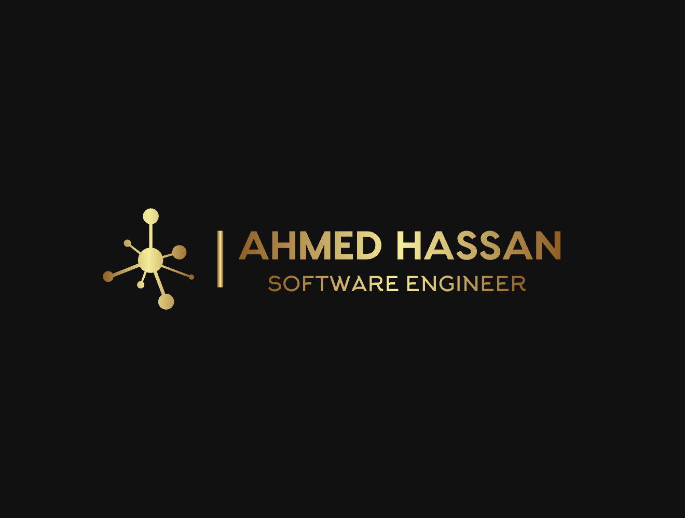

# AHMEDHASSAN7663
MY GITHUB PROFILE

<h1 align="center">Hi 👋, I'm AHMED HASSAN</h1>
<h3 align="center">An Enthusiastic and Dedicated Programmer from PAKISTAN </h3>

I am captivated by the transformative power of computer technology 🌐, which has reshaped our lives in ways once unimaginable. Witnessing the evolution of computer science inspired me to pursue software engineering from a young age, and my enthusiasm for the field has only deepened since. I also love exploring new tech stacks 💻 and using them to create innovative solutions that make a meaningful impact🛠️

 
  

 
  
  
  
 

 

  
  
  

  

- 🔭 I’m currently working at Nexentra Solutions**

- 🌱 I’m currently learning **Devops**

- 👨‍💻 All of my project's details are available at [Ahmed's Projects](https://ahmad7663.github.io/AhmedHassan.github.io/#teams)

- 💬 Ask me about **C++, Javascript,React,**

- 📫 How to reach me **ahmedhassan7663@gmail.com**

- 📄 Know about my experiences [My Experiences](https://ahmad7663.github.io/AhmedHassan.github.io/#about)

 
<h3 align="left">Connect with me:</h3>

 

<h3 align="left">Languages and Tools:</h3>

- Backend

  

- Frontend

  

- Database

  

- Cloud Servers

  

- Tools

  

 

<h3 align="left">Trophies:</h3>

  

 

 

 

   

<h3 align="left">GitHub Stats:</h3>

 

  

<h3 align="left">Activity:</h3>

  

<h3 align="left">Achievements:</h3>

   

 <em><b>I love connecting with different people</b> so if you want to say <b>hi, I'll be happy to meet you more!</b> :)</em>

 

 Created with 🧡 by <a href="http://supun.traditionalme.life">Supun Nanayakkara</a>

